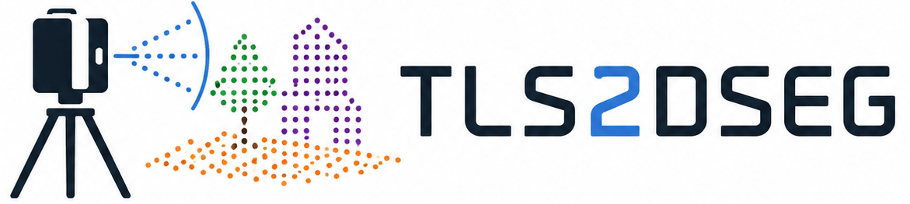
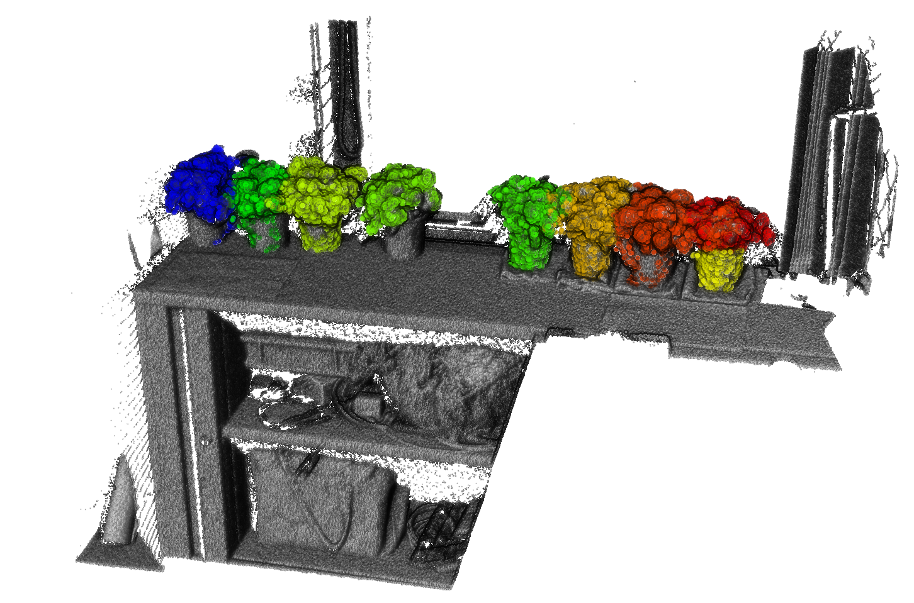
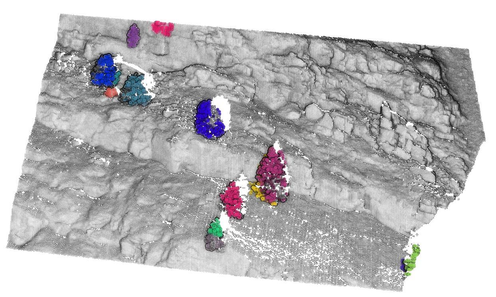
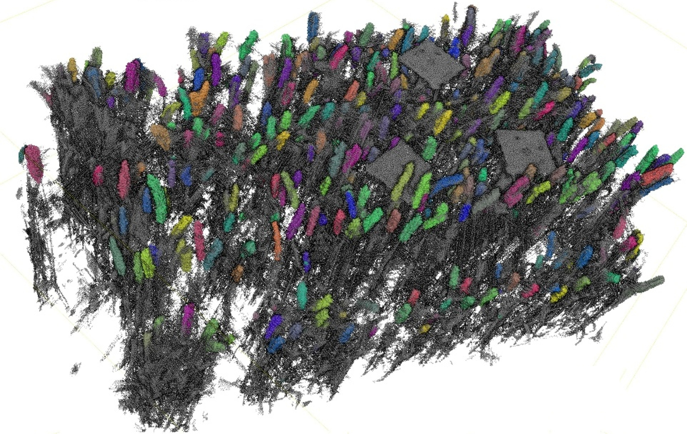

<p align="center"></p>

Open-vocabulary 3D segmentation for terrestrial laser scan (TLS) point clouds
via 2D foundation models.

<p align="center"></p>

## What it does

`tls2dseg` takes registered `.e57` (or `.ply` / `.las` / `.laz`) scans and a `text prompt` as a plain-language list
of objects to find, then produces per-instance, per-class segmented point clouds in 3D.
The core idea: project each scan onto an image (default: 2D spherical panoramic image from the original
viewpoints at high resolution), run inference (deafault: Grounded-DINO + SAM2) on those images to detect and segment objects,
then lift the 2D masks back to 3D points. In `multi-view` mode, `stage2` of the pipeline runs cross-scan
multi-view label-fusion (default: using view-consensus graph-based approach inspired by MaskClustering
algorithm) and merges detections across all co-registered scans into a unified labelled point cloud.

The tool is configured entirely through a YAML file and runs over CLI or a function call. No source-code edits required.
The tool is build to be plug-n-play easily modifiable and support different projection, inference and label-fusion engines.

## Key Features

- **Spherical panoramic projection** — auto-detects scan-resolution, efficiently rasterizes TLS point clouds to full-resolution panoramic images using `pc2img` (default rasterization method: `nanconv`), rasterization of different `feature` images (default: `range`, `intensity`), auto HQ image re-scaling (`lancoz3`) befor inference.
- **Open-vocabulary detection + segmentation** — Grounded-DINO (HuggingFace API) for text-prompted bounding boxes / object detection;
  SAM2 for per-instance masks (choice: HuggingFace or original SAM2 GitHub implementation); works with any natural-language object-class description. Uses SAHI (Slicing Aided Hyper Inference) to assure HQ segmentation results for small objects.
- **Per-class adaptive multi-zoom inference** — each object class is inferred at auto-estimated image zoom levels
  where the objects' pixel-size corresponds to the detector's sweet spot. This is derived from per-class approximate physical size in
  metres (mandatory input `sizes_m`) and per-scan interval of measured ranges/distances (auto estimated). This is default which replaces an optional single manually-tuned zoom.
- **Two pipeline modes** — `single-view` processes N scans independently (good for TLS time series from a single-viewpoint);
  `multi-view` runs cross-scan multi-view label-fusion (`stage2`) to merge detections into one unified cloud.
- **Multi-veiw label-fusion** — efficient implementation based on graphs with sparse KNN connectivity, 3D-IoU refined connectivity, view-consensus based edge weights and clustering using a engine (default: `hcs` based on MaskClustering),
  graph clustering merge redundant detections across scan stations.
- **Large point clouds** — reasonably compute-efficient (partially paralellized, single GPU bottleneck), tested on a set of 16x 2-4GB heavy TLS point clouds, each producing panoramic images of up to 20,000 x 40,000 pixels (this run took several hours).
- **Filters and outlier removals** — a number of methods are implemented to filter out unlikely segmentation results. Turning knobs for all filters are exposed to end-users over the config YAML file.
- **pchandler and pc2img** relies on 2 home-brewed forks of GSEG@ETHZ-developed public repos for point cloud processing (has a small impact on the installation procedure): `pchandler` (https://github.com/gseg-ethz/PCHandler/tree/develop/tomislav) and `pc2img` (https://github.com/gseg-ethz/pc2img/tree/develop/tomislav)


## Installation

**Prerequisites:**

- Python 3.11
- System library: `libvips` (required by `pyvips`)
- NVIDIA GPU is strongly recommended; CPU-only mode should work, but is barely usable (I used it for testing).

```bash
# System deps (Debian/Ubuntu)
sudo apt-get install -y libvips-dev git

# Install tls2dseg
pip install "git+https://github.com/tomedic/tls2dseg.git" (v0.1.0)
```

**SAM2 checkpoint (required for the default `grounded_sam2` engine):**

The default engine (`inference.type: grounded_sam2`) uses the direct `sam2` package and requires a
local model checkpoint. Download `sam2.1_hiera_large.pt` from Meta's
[SAM2 GitHub releases](https://github.com/facebookresearch/sam2/releases) and point to it in your
config:

```yaml
inference:
  sam2_checkpoint: /path/to/checkpoints/sam2.1_hiera_large.pt
  sam2_model_config: configs/sam2.1/sam2.1_hiera_l.yaml
```

Alternatively, switch to `inference.type: grounded_sam2_hf` to use the HuggingFace Hub engine,
which downloads the checkpoint automatically on first run (see §Architecture). **Important**: I have noticed some reduction in masks quality when using HuggingFace API (investigating the cause is pending).

**Verify the installation:**

```bash
tls2dseg doctor
```

This probes Python, torch/CUDA, libvips, the SAM2 checkpoint, and the `pchandler`/`pc2img`
imports, and reports the status of each.

## Quickstart

The `examples/` directory ships with a small multi-view indoor office dataset (`office_small`), single-view outdoor mountains dataset (`mountains_small`) and ready-to-run corresponding config files:

```bash
tls2dseg run --config examples/configs/office_small.yaml
or
tls2dseg run --config examples/configs/mountain_small.yaml
```

The four primary fields to adjust for your own data:

```yaml
mode: multi-view             # single-view or multi-view

io:
  input_path: ./data/my_scan_folder/   # folder of .e57 scan files
  output_dir:  ./results/

prompt:
  text: "plant. cabinet"    # period-separated object class names
  sizes_m: [0.2, 1.5]      # approximate size in metres per class (for multi-zoom)

preprocessing:
  output_resolution_m: 0.005   # desired resulting point cloud resolution
```

## Datasets

Small example datasets "office_small" and "mountains_small" are shipped with this software (2x2 scans, together < 100 MB) within `./examples/data/` (see the images below).

<p align="center">
  
  &nbsp;&nbsp;
  
</p>

The dataset used in the paper (see image below) ...

Medic, T., & Nan, L. (2026). *In-Field 3D Wheat Head Instance Segmentation From TLS Point Clouds Using Deep Learning Without Manual Labels*. arXiv:2603.14309. https://doi.org/10.48550/arXiv.2603.14309

... is available upon request (email: tmedic@ethz.ch).

<p align="center">
  
</p>

## Where results land


Every run creates a timestamped directory under `output_dir/<run_id>/`:

```
<run_id>/
├── run_info/                    # run.log, config.yaml + context.yaml (resolved config/run snapshot), git.txt, env.txt
├── intermediate/
│   ├── stage_1_partial/         # per-(scan, feature) resume checkpoints: pcd_ij_<N>.pkl + d3d_ij_<N>.pkl (always written)
│   └── ...                      # extra visual intermediates only when save_intermediate: true — see note below
└── results/
    ├── <scan_name>_segmented.ply        # single-view: one file per input scan
    │                                    #   or <scan_folder_name>_segmented.ply — multi-view: one merged cloud
    └── class_names_id_map.txt           # class name → integer id map
```

See [`docs/output-contract.md`](docs/output-contract.md) for the full per-mode artifact contract.
When `save_intermediate: true`, stage 1 additionally writes visual intermediates under `intermediate/`:
projection images (`images/`), per-scan per-feature object-detection overlays (`object_detection/`) and
SAM2 mask overlays (`sam2/`), RLE mask JSON (`masks_json/`), and per-feature segmented point clouds
(`segmented_point_clouds/`). For example, `intermediate/sam2/` shows — per scan and per feature — the
detected object boxes with their SAM2 masks overlaid on the projected image.

To validate a config without running inference:

```bash
tls2dseg validate-config examples/configs/office_small.yaml
```

## Configuration (config YAML)

`tls2dseg` is configured entirely through config YAML files. Every field carries one of four tags that indicate
how relevant it is to a typical user:

| Tag | Meaning |
|-----|---------|
| `primary` | Fields you almost always need to set for your own dataset |
| `tuning` | Fields that directly affect segmentation quality (thresholds, zoom parameters), defaults should work reasonably well |
| `pipings` | Infrastructure knobs (inference device GPU/CPU, #CPU workers, checkpoint resume, logging, ...) |
| `other` | Did not know where to put them, might have an impact on segmentation results, but are not obvious tuning parameters |

The example configs in `examples/configs/` include the tags as inline comments.

For the full field reference grouped by tag, see [`docs/config-schema.md`](docs/config-schema.md).
Regenerate it whenever models change:

```bash
tls2dseg schema --output docs/config-schema.md
```

## Python API

The CLI is a thin wrapper over the `Pipeline` class. You can call it directly for scripting or
integration into a larger workflow:

```python
from pathlib import Path
from tls2dseg.pipeline.pipeline import Pipeline

pipeline = Pipeline.from_yaml("examples/configs/office_small.yaml")
pipeline.run()  # writes results/ + run_info/ under io.output_dir
```

For finer control, call the stages separately:

```python
# Stage 1 only — per-scan projection + inference + 3D lift
stage1_result = pipeline.stage1()
# stage1_result.pcd_collection  — per-scan point clouds
# stage1_result.d3d_collection  — per-scan Detections3D lists
# stage1_result.n_scans         — number of input scans

# Stage 2 — cross-scan graph fusion (multi-view mode only)
pipeline.stage2(stage1_result)
```

See [`examples/api_usage.py`](examples/api_usage.py) for a complete runnable example on
`office_small`.

## Architecture and Extending

The pipeline is built around three engine `Protocol`s (defined in `engines/protocols.py`):

| Protocol | Role | Default implementation |
|----------|------|----------------------|
| `ProjectionEngine` | Rasterizes a point cloud to feature images | `SphericalProjectionEngine` (`spherical`) |
| `InferenceEngine` | Runs 2D detection + segmentation on images | `GroundedSAM2Engine` (`grounded_sam2`) |
| `FusionEngine` | Cross-scan multi-view label-fusion (stage 2) | `GraphClusterFusionEngine` (`graph_cluster`) |

Each Protocol has a corresponding dict registry in `engines/__init__.py` (e.g.
`INFERENCE_ENGINES["grounded_sam2"] = GroundedSAM2Engine`). To add a new engine: implement the
Protocol, add an entry to the registry, and select it by name via the config `type` field. See
[`CONTRIBUTING.md`](CONTRIBUTING.md) for more info.

**SAM2 inference engine default:**

The default is `inference.type: grounded_sam2` — the direct `sam2` package with a local `.pt`
checkpoint. To switch to the HuggingFace Hub engine, which downloads the checkpoint automatically on first run adjust config YAML fields to:

```yaml
inference:
  type: grounded_sam2_hf
  sam2_hf_model_id: facebook/sam2.1-hiera-large
```
**Important:** Hugging face implementation might be producing lower quality masks (I need to further investigate this).


## Related and prior works

* **[MaskClustering](https://github.com/PKU-EPIC/MaskClustering)** — *View Consensus based Mask Graph Clustering for Open-Vocabulary 3D Instance Segmentation*.

* **[Grounding DINO](https://github.com/IDEA-Research/GroundingDINO)** — *Marrying DINO with Grounded Pre-Training for Open-Set Object Detection*.

* **[Grounded-Segment-Anything / Grounded-SAM](https://github.com/IDEA-Research/Grounded-Segment-Anything)** — *Assembling Open-World Models for Diverse Visual Tasks*.

* **[Segment Anything Model 2 / SAM 2](https://github.com/facebookresearch/sam2)** — Meta’s successor to SAM, extending promptable segmentation to both images and videos.


## License and Citation

`tls2dseg` is released under the [GNU General Public License v3.0](LICENSE). The copyleft
requirement follows from runtime dependencies `leidenalg` (GPL-3.0) and `igraph` (GPL-2.0+) used
in the cross-scan fusion stage.

If you use this software in your research, please cite both the software and the accompanying paper:

### Software

Please use the citation information provided by the `CITATION.cff` file or the “Cite this repository” button on GitHub.

### Paper

Medic, T., & Nan, L. (2026). *In-Field 3D Wheat Head Instance Segmentation From TLS Point Clouds Using Deep Learning Without Manual Labels*. arXiv:2603.14309. https://doi.org/10.48550/arXiv.2603.14309
